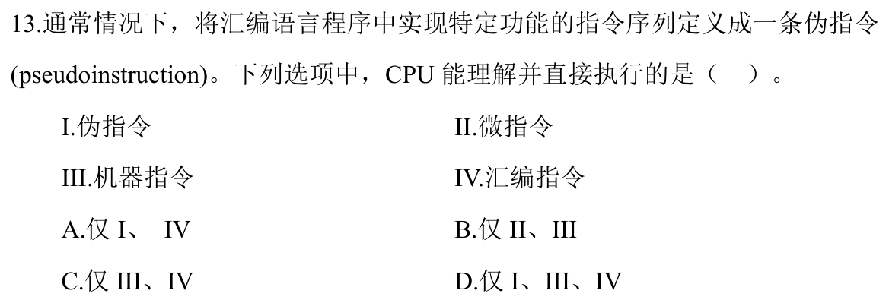
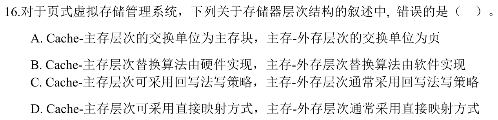
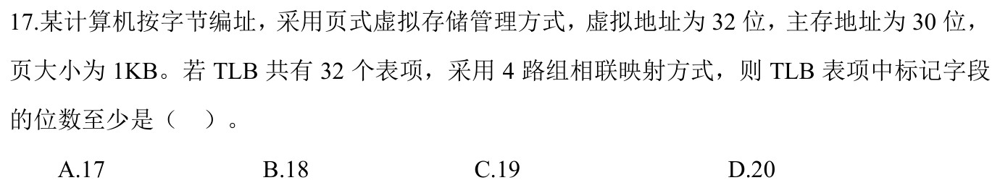
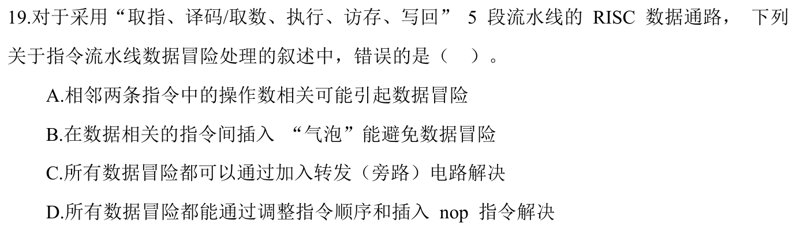
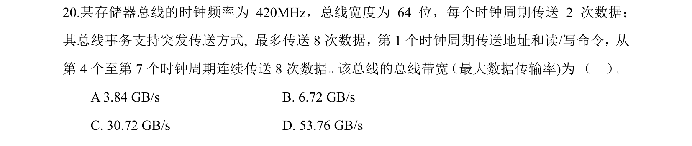
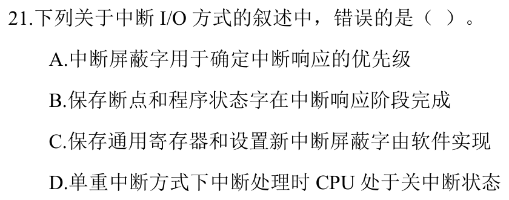
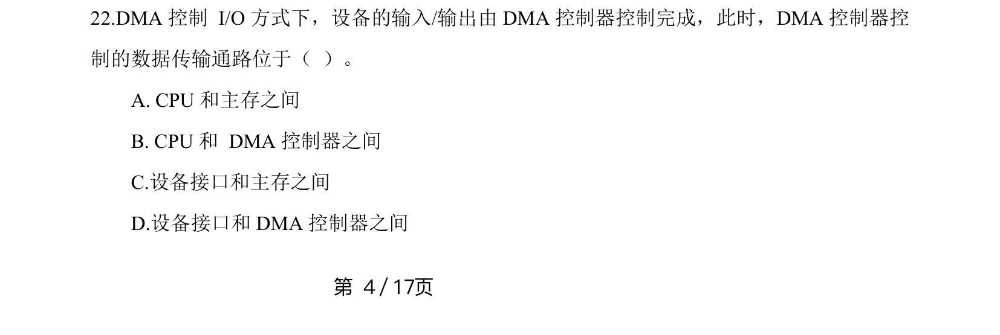
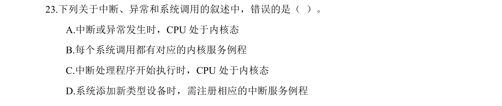
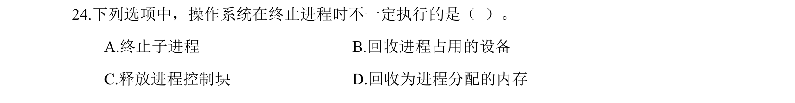

[« 0710-day06](0710-day06.md) | [» 0712-day08](0712-day08.md)

# Day 07 · 2026-07-11

> [!IMPORTANT]  [打开答题卡](http://127.0.0.1:8409/?date=0711)

> 今日 10 题；答题卡可选 `A/B/C/D/?`，`?` 表示不会。

## 题目

### 01 · 2024-13

### 02 · 2024-16

### 03 · 2024-17

### 04 · 2024-18

### 05 · 2024-19

### 06 · 2024-20

### 07 · 2024-21

### 08 · 2024-22

### 09 · 2024-23

### 10 · 2024-24

## 结果

已答 10 / 10；已判 10 题，对 1 题。

| # | 题号 | 作答 | 答案 | 结果 |
|---:|---|---|---|---|
| 01 | 2024-13 | C | B | ✗ |
| 02 | 2024-16 | 不会 | D | 不会 |
| 03 | 2024-17 | 不会 | C | 不会 |
| 04 | 2024-18 | D | B | ✗ |
| 05 | 2024-19 | D | C | ✗ |
| 06 | 2024-20 | 不会 | B | 不会 |
| 07 | 2024-21 | 不会 | A | 不会 |
| 08 | 2024-22 | 不会 | C | 不会 |
| 09 | 2024-23 | 不会 | A | 不会 |
| 10 | 2024-24 | A | A | ✓ |
[« 0710-day06](0710-day06.md) | [» 0712-day08](0712-day08.md)
