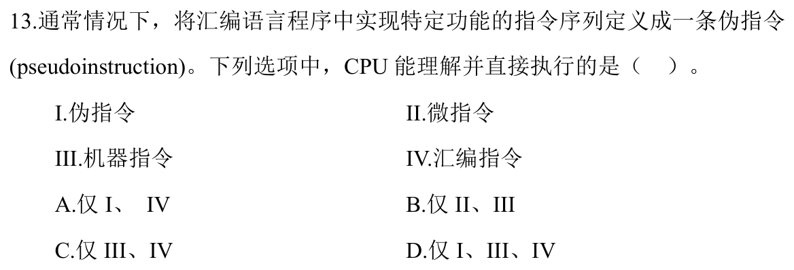
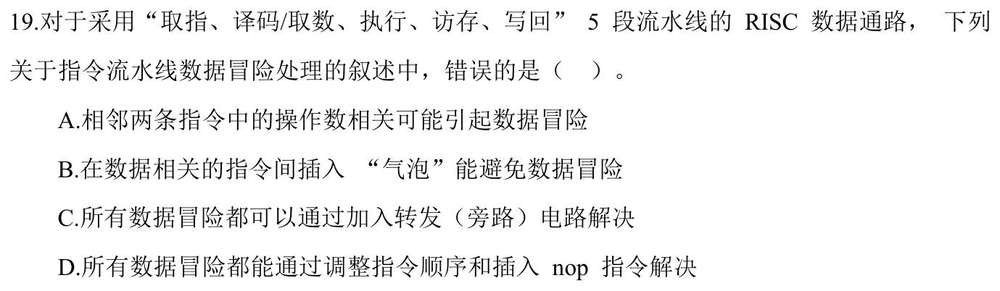

# Day 16 · 2026-07-02

共 42 题，今日未作答

### Q1 · 2024-12

（未作答）

### Q2 · 2024-14

（未作答）

### Q3 · 2024-15

（未作答）

### Q4 · 2025-12

（未作答）

### Q5 · 2025-13

（未作答）

### Q6 · 2025-14

（未作答）

### Q7 · 2025-15

（未作答）

### Q8 · 2024-16

（未作答）

### Q9 · 2024-17

（未作答）

### Q10 · 2024-18

（未作答）

### Q11 · 2024-13

（未作答）

### Q12 · 2025-16

（未作答）

### Q13 · 2024-19

（未作答）

### Q14 · 2024-23

（未作答）

### Q15 · 2025-24

（未作答）

### Q16 · 2024-24

（未作答）

### Q17 · 2024-25

（未作答）

### Q18 · 2024-28

（未作答）

### Q19 · 2024-30

（未作答）

### Q20 · 2025-25

（未作答）

### Q21 · 2024-27

（未作答）

### Q22 · 2025-23

（未作答）

### Q23 · 2025-26

（未作答）

### Q24 · 2025-02

（未作答）

> ❓ 2026-06-27T17:06　这里虽然题干存在错误，但是存在一点，问题问的是，栈的容量是存括号的数量，还是处理数字的数量，前者是什么问题，后者是什么问题，这个问题没有解决

### Q25 · 2025-05

（未作答）

### Q26 · 2024-05

（未作答）

> ❓ 2026-06-30T01:36　折半查找意味着什么；2和4又意味着什么

### Q27 · 2025-08

（未作答）

> ❓ 2026-06-30T01:40　不懂B树

### Q28 · 2025-09

（未作答）

> ❓ 2026-06-30T01:42　先把C D的同义词和非同义词搞懂，再来判断线性探查和散列的区别

### Q29 · 2024-09

（未作答）

> ❓ 2026-06-30T01:53　不懂大根堆的步骤和细节内容

### Q30 · 2024-10

（未作答）

> ❓ 2026-06-30T01:58　不懂二路归并排序的步骤和细节

### Q31 · 2024-11

（未作答）

> ❓ 2026-06-30T01:58　不懂败者树的内容

### Q32 · 2025-10

（未作答）

> ❓ 2026-06-30T01:59　不懂排序算法的最坏的影响和元素移动的细节

### Q33 · 2024-33

（未作答）

### Q34 · 2025-33

（未作答）

### Q35 · 2024-34

（未作答）

### Q36 · 2024-35

（未作答）

### Q37 · 2024-36

（未作答）

### Q38 · 2024-37

（未作答）

### Q39 · 2025-34

（未作答）

### Q40 · 2025-35

（未作答）

### Q41 · 2025-37

（未作答）

### Q42 · 2024-38

（未作答）
