[← 0802](0802.md) · [总索引](README.md) · [0804 →](0804.md)

# 0803｜树的形状：遍历序列如何约束结构

> 能力线 `04-tree-shape` · 第 04/40 个节点 · 27 道真题引用
>
> [打开答题卡](http://127.0.0.1:8409/?date=0803)

## 故事梗概

树题不断改变外表，稳定的动作是从孩子关系、层次和遍历次序恢复结构约束。森林转换、线索、顺序存储和结点计数都是这幅结构图的不同截面。

这里的日期是链表节点，不是完成期限；是否前进，由这条能力线能否从题干恢复决定。

## 题单

### 01 · 2009-03

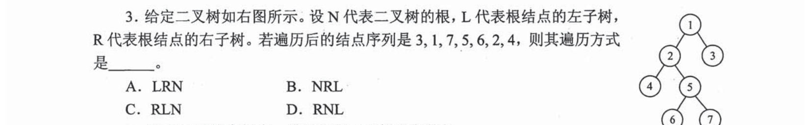

### 02 · 2009-05

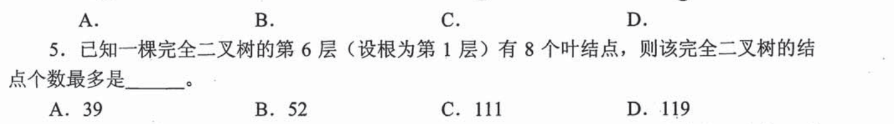

### 03 · 2009-06

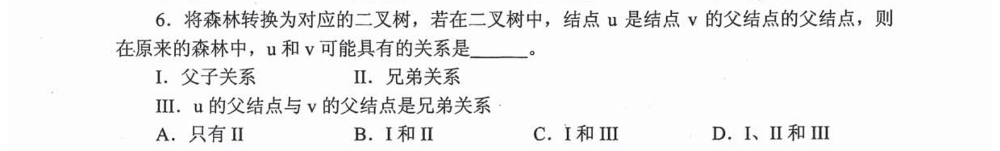

### 04 · 2010-03

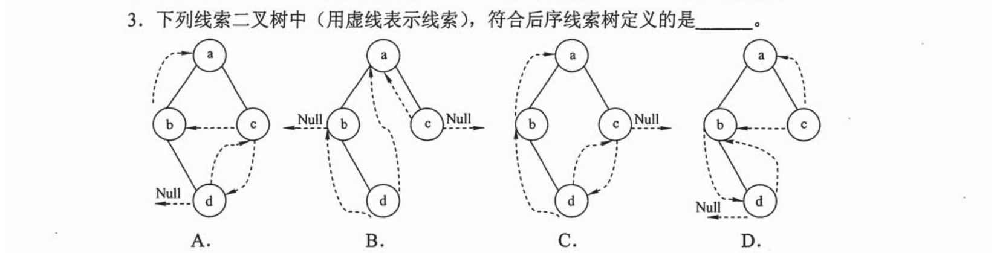

### 05 · 2010-05

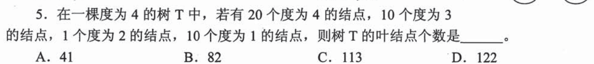

### 06 · 2011-04

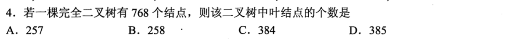

### 07 · 2011-05

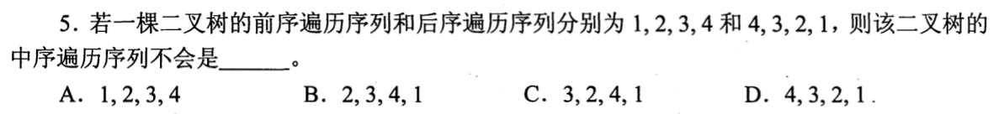

### 08 · 2011-06

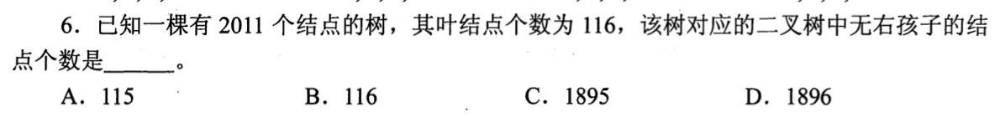

### 09 · 2012-03

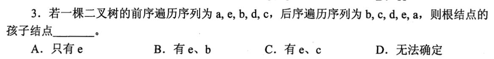

### 10 · 2013-05

### 11 · 2014-04

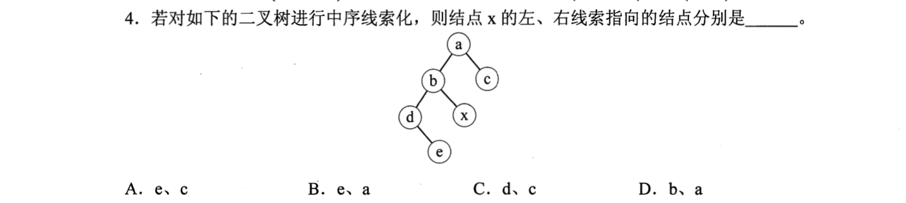

### 12 · 2014-05

### 13 · 2015-02

### 14 · 2016-05

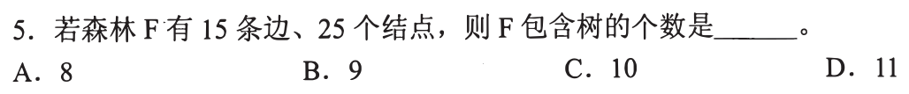

### 15 · 2017-04

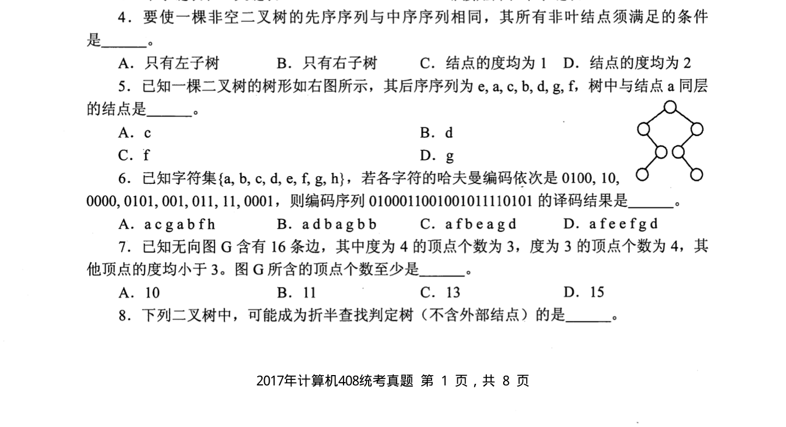

### 16 · 2017-05

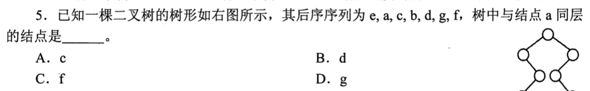

### 17 · 2018-04

### 18 · 2019-02

### 19 · 2020-03

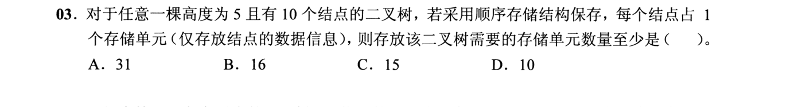

### 20 · 2020-04

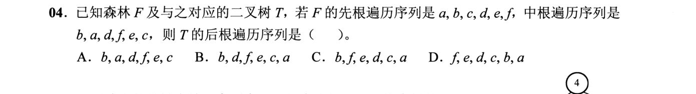

### 21 · 2021-04

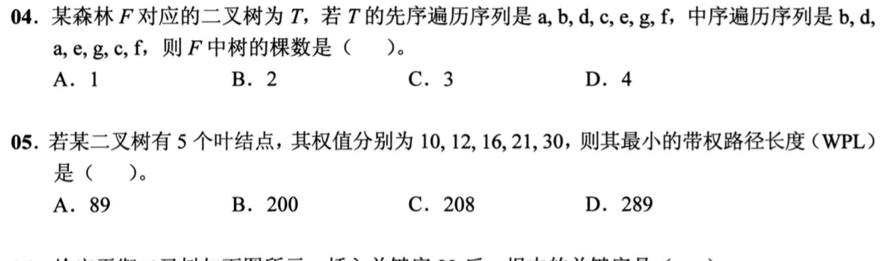

### 22 · 2022-03

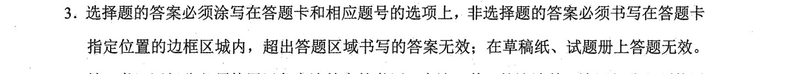

### 23 · 2022-04

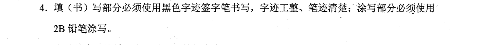

### 24 · 2023-05

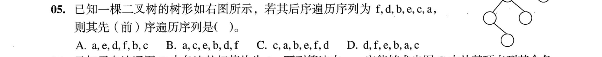

### 25 · 2024-03

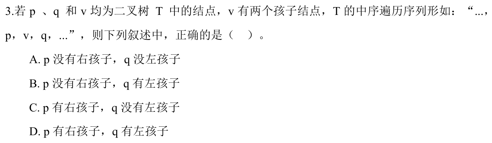

### 26 · 2025-03

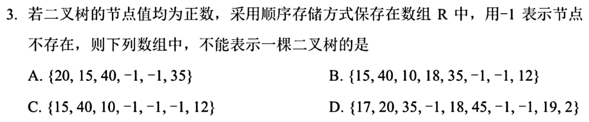

### 27 · 2025-04

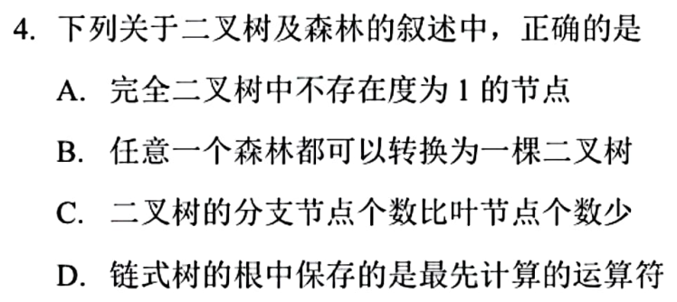

[← 0802](0802.md) · [总索引](README.md) · [0804 →](0804.md)
