[← 0807](0807.md) · [总索引](README.md) · [0809 →](0809.md)

# 0808｜查找落点：折半、分块与散列

> 能力线 `09-search-hash` · 第 09/40 个节点 · 15 道真题引用
>
> [打开答题卡](http://127.0.0.1:8409/?date=0808)

## 故事梗概

查找题的共同动作，是根据已经排除的范围确定下一次比较位置。折半依靠有序边界，散列依靠地址函数和冲突处理；后期题越来越强调失败查找和删除以后仍需维持的搜索路径。

这里的日期是链表节点，不是完成期限；是否前进，由这条能力线能否从题干恢复决定。

## 题单

### 01 · 2010-09

### 02 · 2011-09

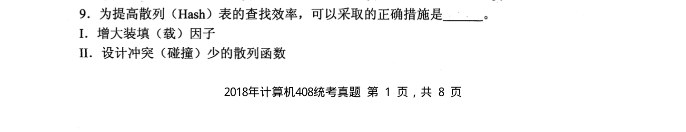

### 03 · 2014-08

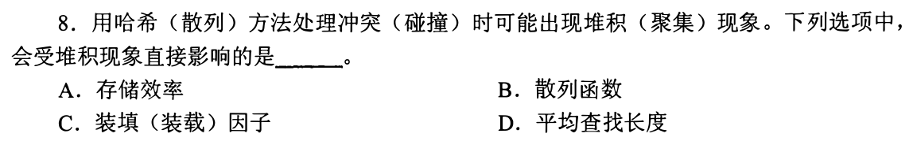

### 04 · 2015-07

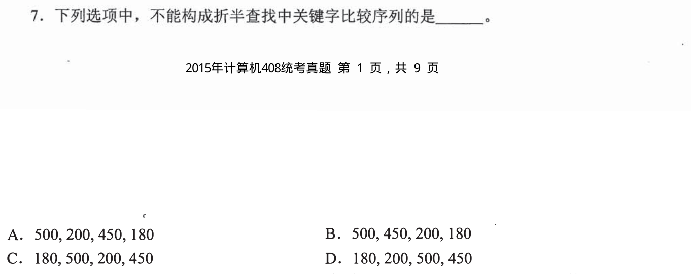

### 05 · 2016-09

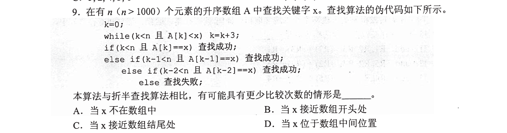

### 06 · 2017-08

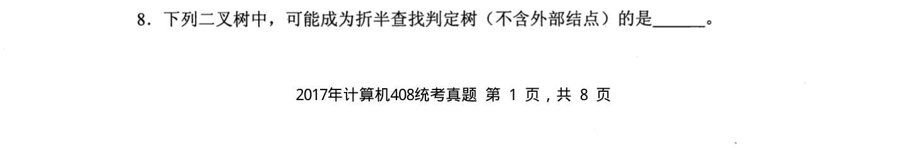

### 07 · 2017-09

### 08 · 2018-09

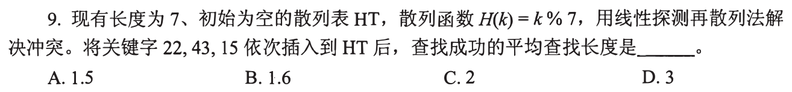

### 09 · 2019-08

### 10 · 2022-09

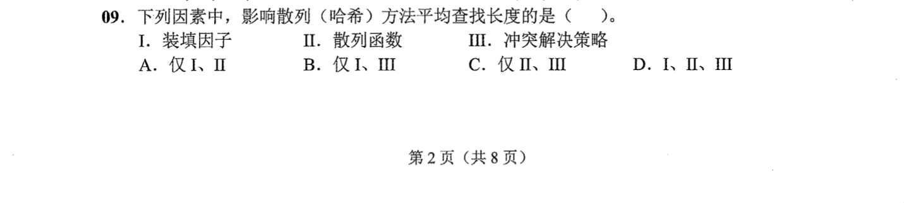

### 11 · 2023-08

### 12 · 2023-09

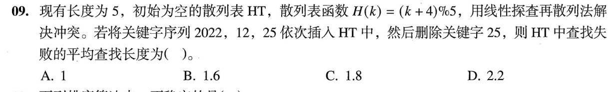

### 13 · 2024-05

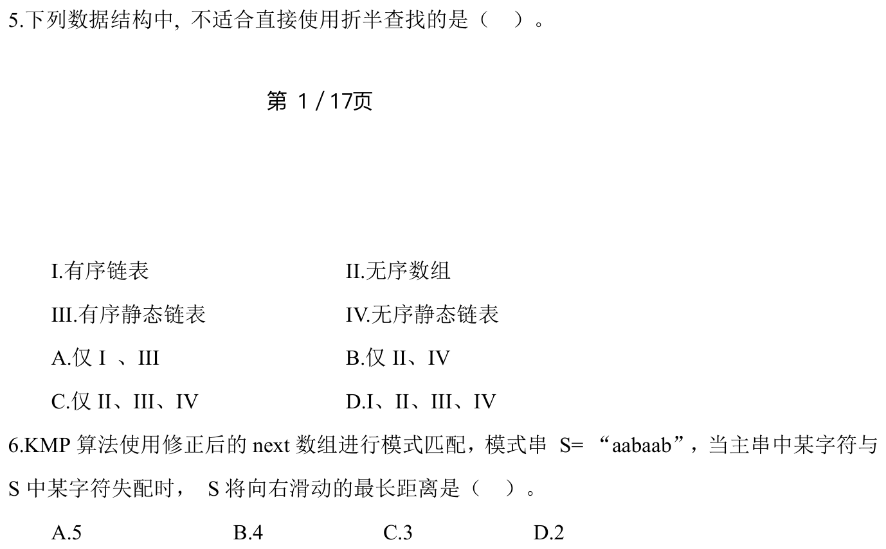

### 14 · 2025-07

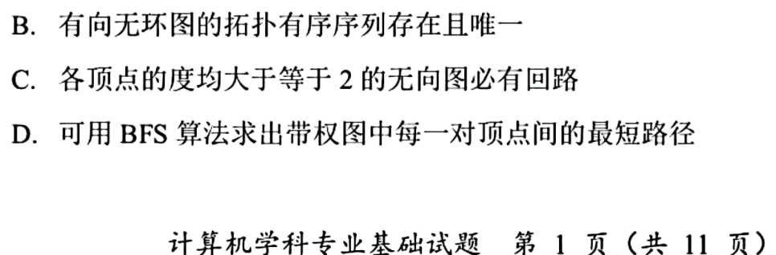

### 15 · 2025-09

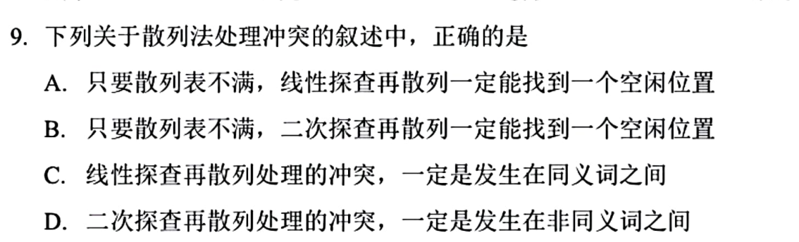

[← 0807](0807.md) · [总索引](README.md) · [0809 →](0809.md)
