[← 0809](0809.md) · [总索引](README.md) · [0811 →](0811.md)

# 0810｜排序过程：一趟以后什么已经确定

> 能力线 `11-sort` · 第 11/40 个节点 · 34 道真题引用
>
> [打开答题卡](http://127.0.0.1:8409/?date=0810)

## 故事梗概

排序算法的名称很多，真题反复追问的是一次操作改变了哪些相对位置、哪些元素已经到达最终位置，以及初始状态和存储方式怎样改变代价。

这里的日期是链表节点，不是完成期限；是否前进，由这条能力线能否从题干恢复决定。

## 题单

### 01 · 2009-09

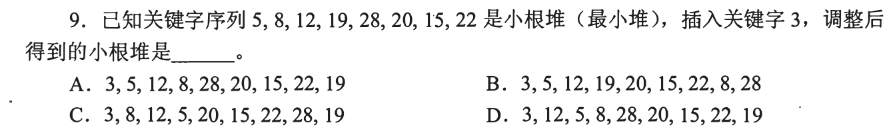

### 02 · 2009-10

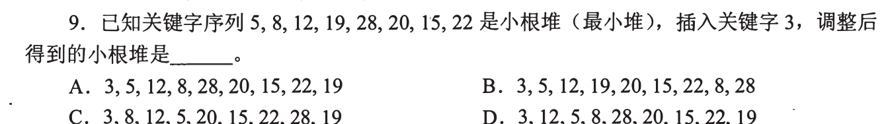

### 03 · 2009-11

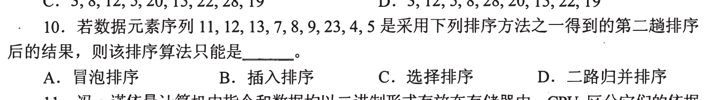

### 04 · 2010-10

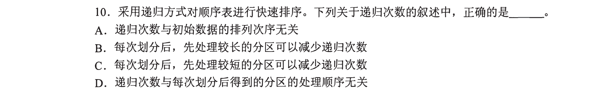

### 05 · 2010-11

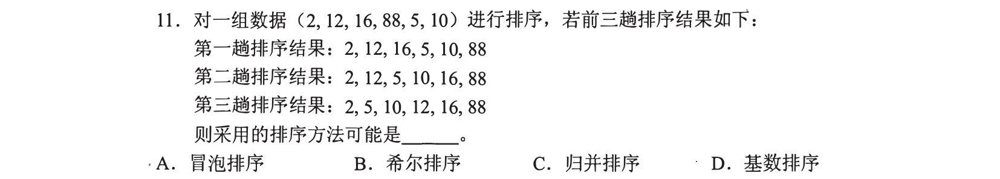

### 06 · 2011-10

### 07 · 2011-11

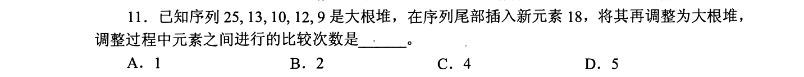

### 08 · 2012-10

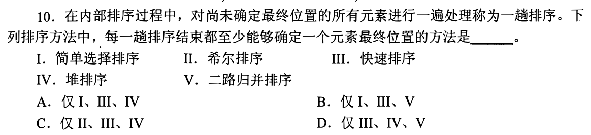

### 09 · 2012-11

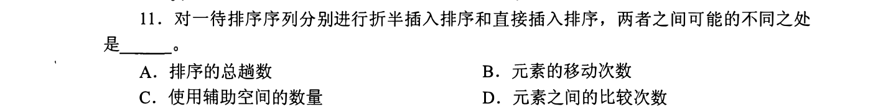

### 10 · 2013-11

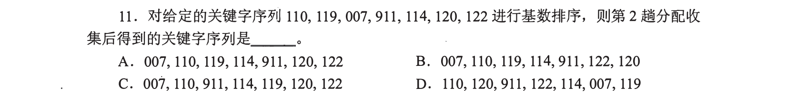

### 11 · 2014-10

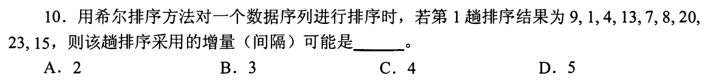

### 12 · 2014-11

### 13 · 2015-09

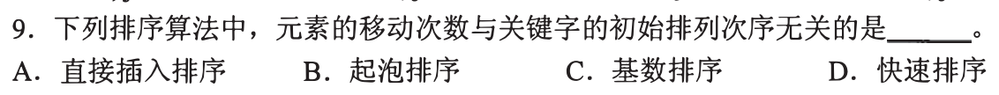

### 14 · 2015-10

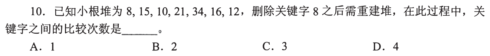

### 15 · 2015-11

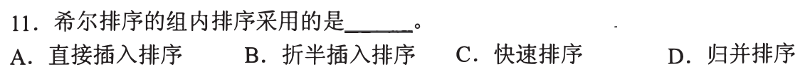

### 16 · 2017-10

### 17 · 2017-11

### 18 · 2018-10

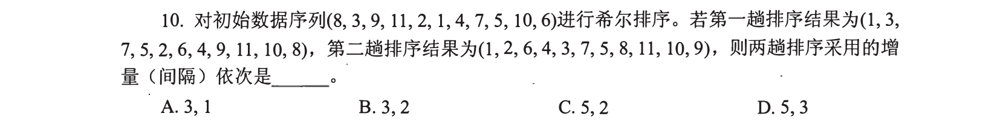

### 19 · 2018-11

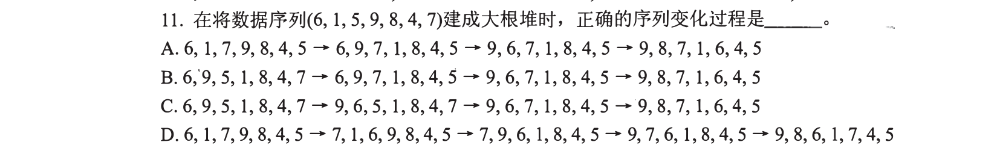

### 20 · 2019-07

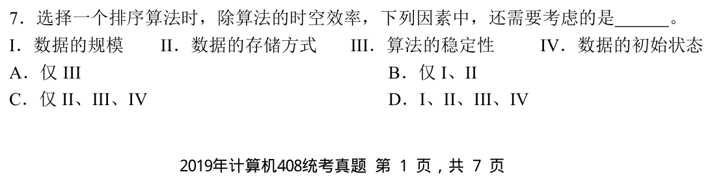

### 21 · 2019-10

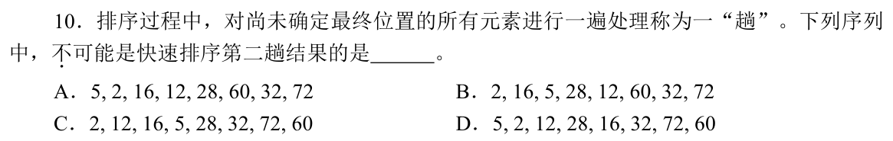

### 22 · 2020-09

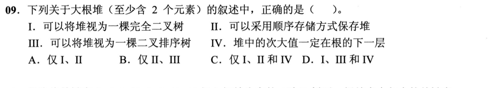

### 23 · 2020-11

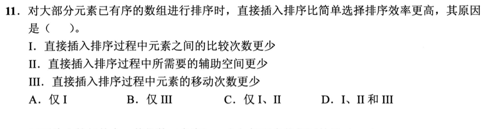

### 24 · 2021-10

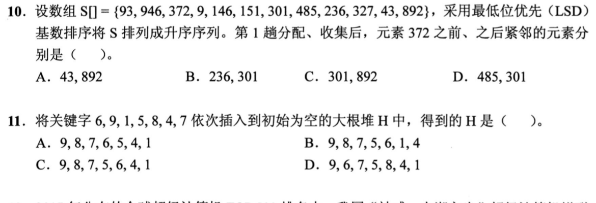

### 25 · 2021-11

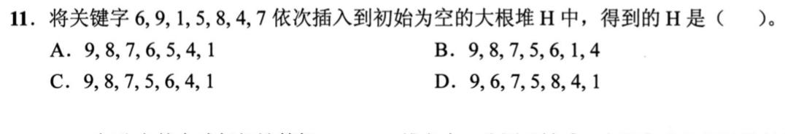

### 26 · 2022-10

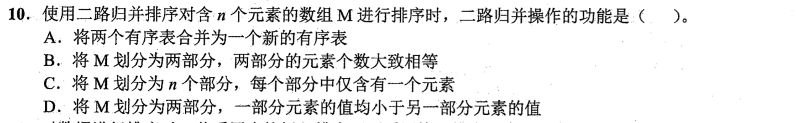

### 27 · 2022-11

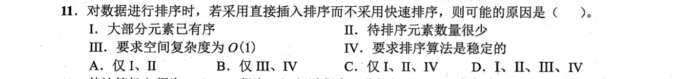

### 28 · 2023-10

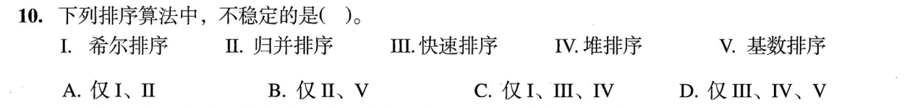

### 29 · 2023-11

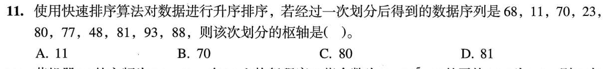

### 30 · 2024-08

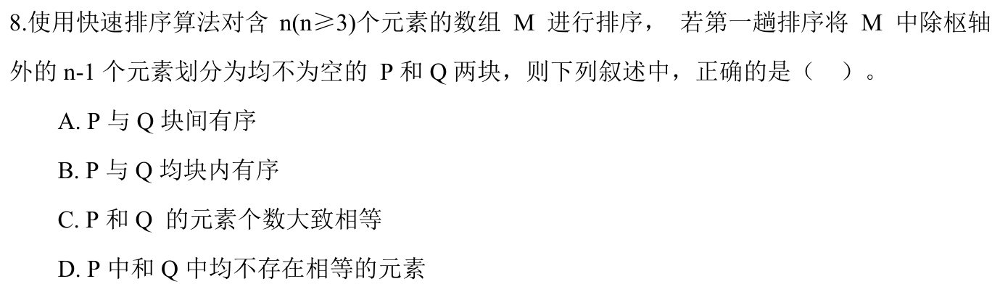

### 31 · 2024-09

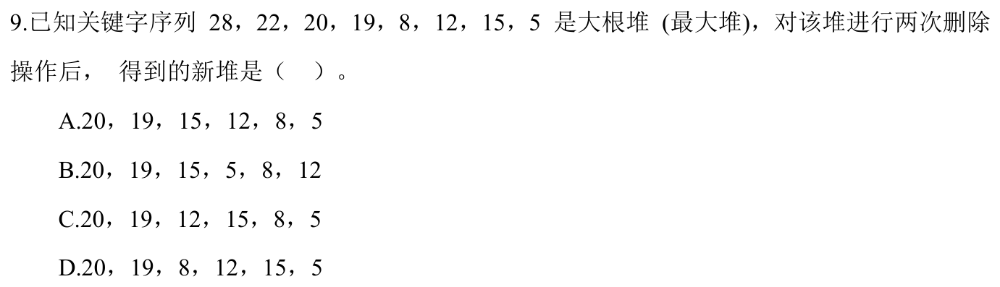

### 32 · 2024-10

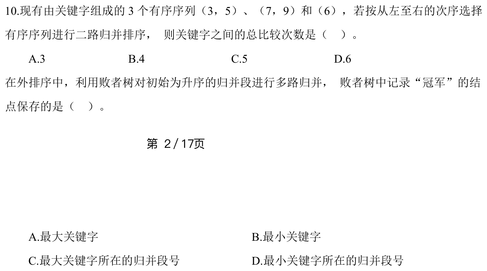

### 33 · 2025-10

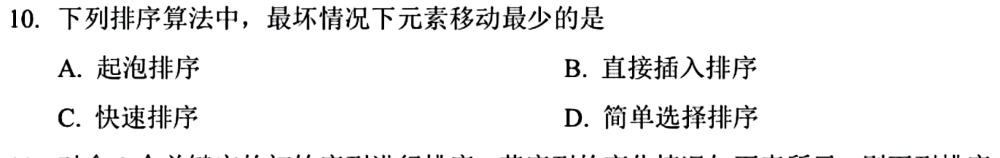

### 34 · 2025-11

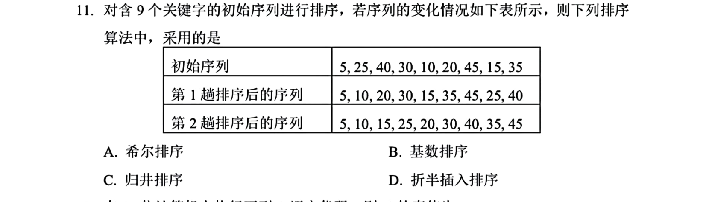

[← 0809](0809.md) · [总索引](README.md) · [0811 →](0811.md)
