[← 0822](0822.md) · [总索引](README.md) · [0824 →](0824.md)

# 0823｜I/O路径：轮询、中断与DMA怎样交接控制权

> 能力线 `24-io-path` · 第 24/40 个节点 · 31 道真题引用
>
> [打开答题卡](http://127.0.0.1:8409/?date=0823)

## 故事梗概

I/O题要追踪数据、控制信息和总线使用权分别经过哪里。轮询占用CPU时间，中断转移处理流程，DMA接管数据搬运；后期题更强调每一步由硬件还是软件完成。

这里的日期是链表节点，不是完成期限；是否前进，由这条能力线能否从题干恢复决定。

## 题单

### 01 · 2009-22

### 02 · 2010-21

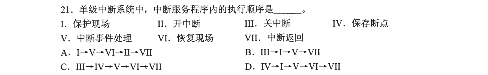

### 03 · 2011-21

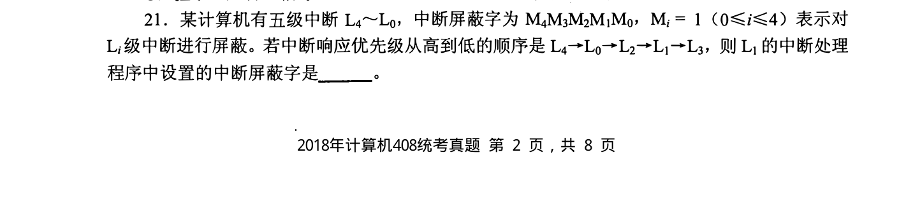

### 04 · 2011-22

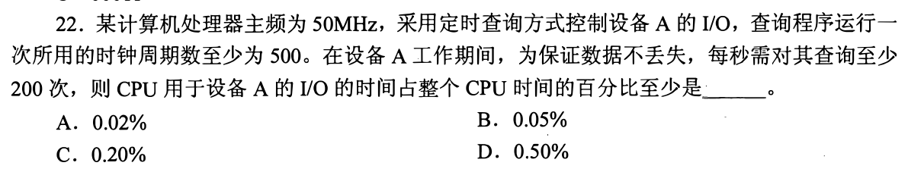

### 05 · 2011-26

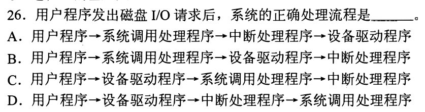

### 06 · 2012-21

### 07 · 2012-22

### 08 · 2013-19

### 09 · 2013-22

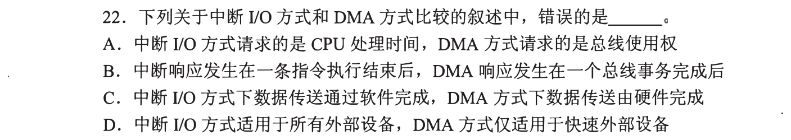

### 10 · 2014-21

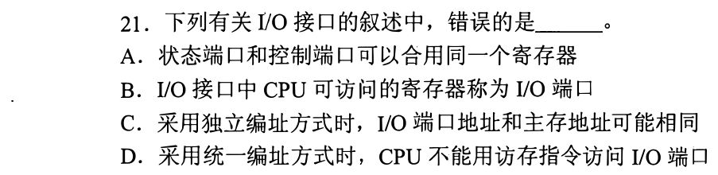

### 11 · 2014-22

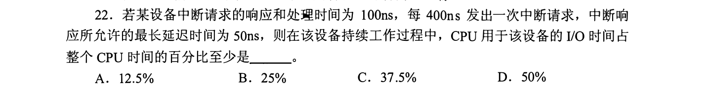

### 12 · 2015-21

### 13 · 2015-22

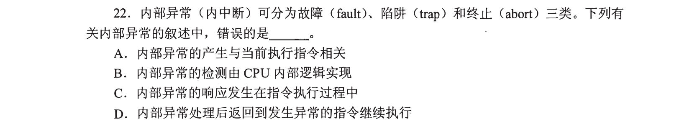

### 14 · 2016-22

### 15 · 2017-21

### 16 · 2017-22

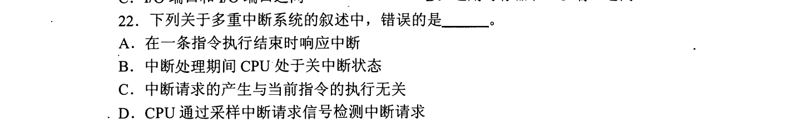

### 17 · 2018-22

### 18 · 2019-21

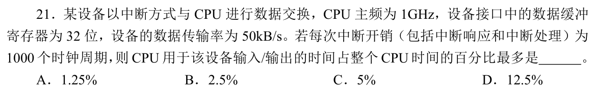

### 19 · 2019-22

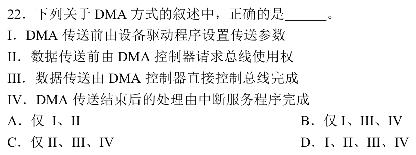

### 20 · 2020-20

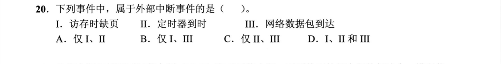

### 21 · 2020-21

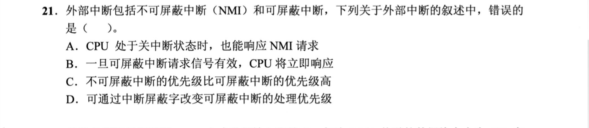

### 22 · 2020-22

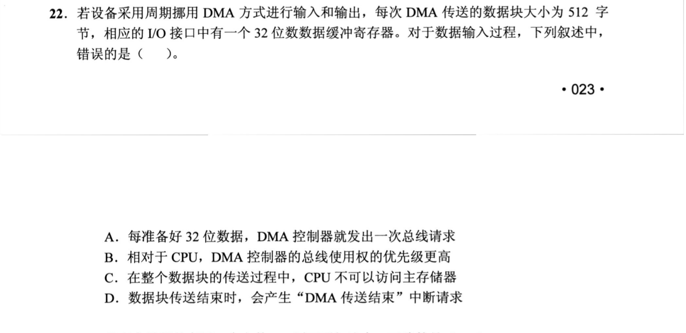

### 23 · 2021-20

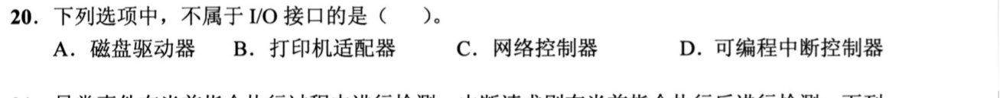

### 24 · 2021-21

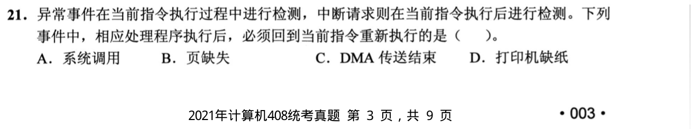

### 25 · 2021-22

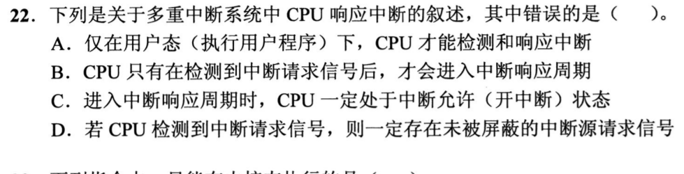

### 26 · 2022-21

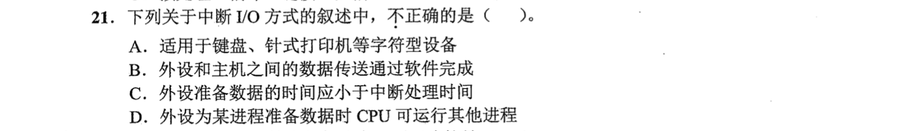

### 27 · 2023-22

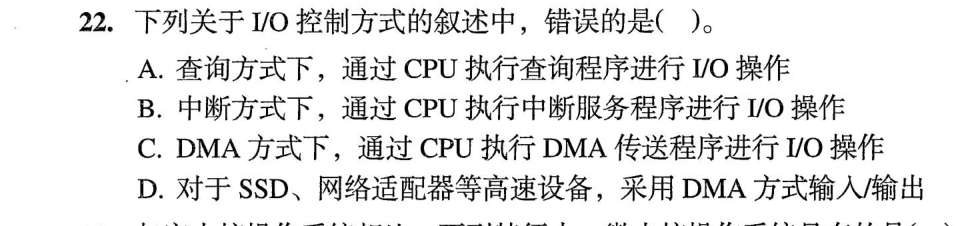

### 28 · 2024-21

### 29 · 2024-22

### 30 · 2025-21

### 31 · 2025-22

[← 0822](0822.md) · [总索引](README.md) · [0824 →](0824.md)
