[← 0824](0824.md) · [总索引](README.md) · [0826 →](0826.md)

# 0825｜执行生命线：进程、线程、状态与调度

> 能力线 `26-process` · 第 26/40 个节点 · 30 道真题引用
>
> [打开答题卡](http://127.0.0.1:8409/?date=0825)

## 故事梗概

进程和线程题围绕一个执行实体何时运行、为何等待、由谁保存现场以及下一次选谁运行。调度算法只是对等待时间、响应和公平性的不同取舍。

这里的日期是链表节点，不是完成期限；是否前进，由这条能力线能否从题干恢复决定。

## 题单

### 01 · 2009-23

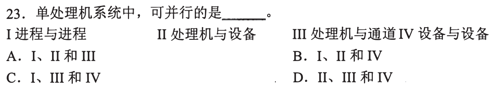

### 02 · 2009-24

### 03 · 2010-24

### 04 · 2010-26

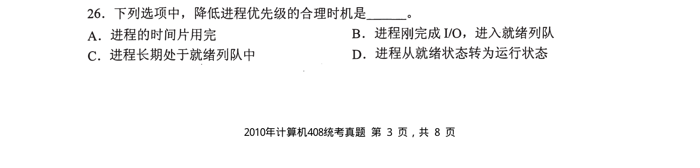

### 05 · 2011-23

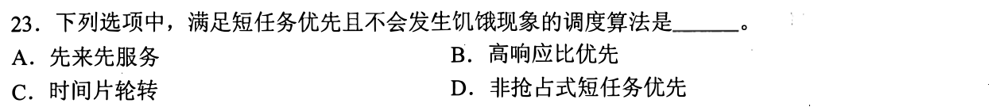

### 06 · 2011-24

### 07 · 2011-25

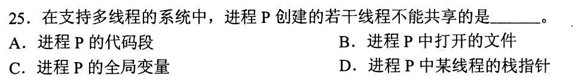

### 08 · 2012-25

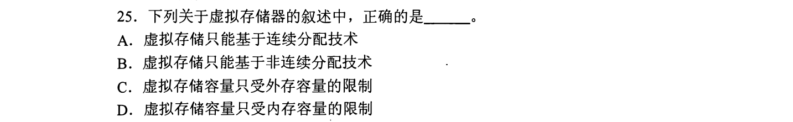

### 09 · 2013-27

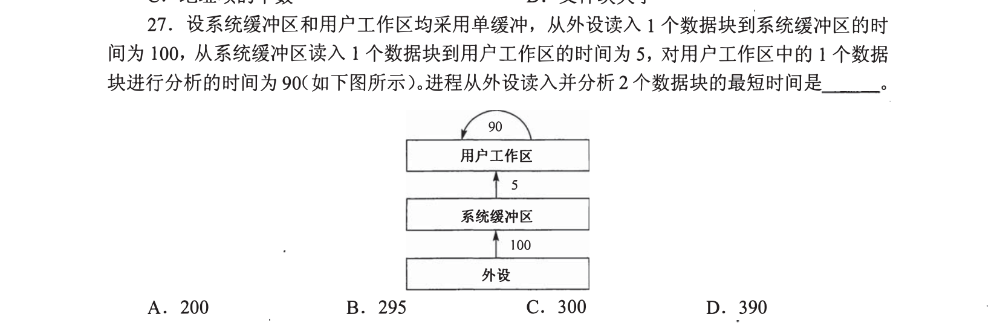

### 10 · 2014-23

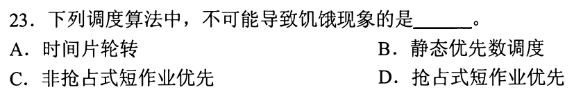

### 11 · 2015-25

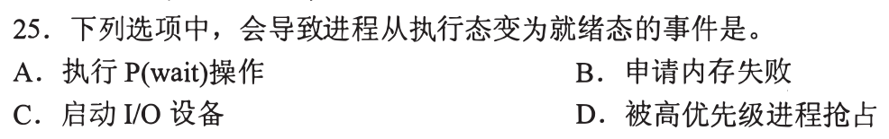

### 12 · 2017-23

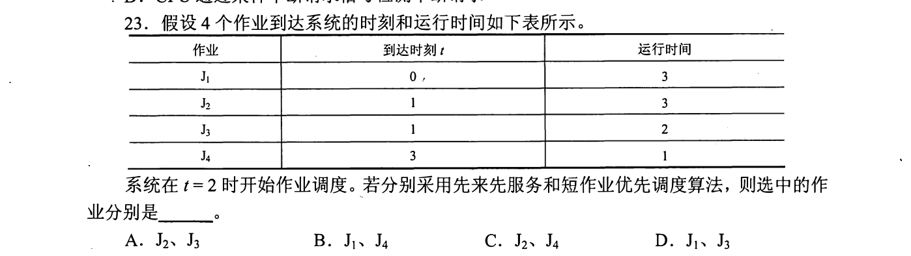

### 13 · 2017-27

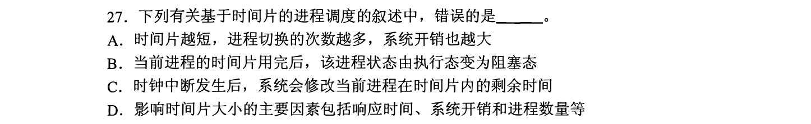

### 14 · 2018-23

### 15 · 2018-24

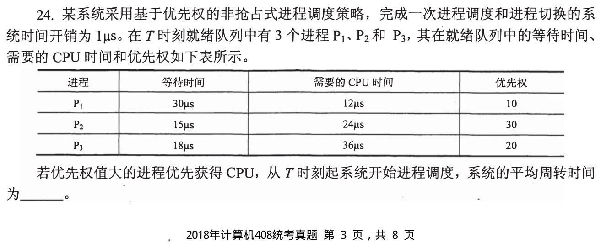

### 16 · 2018-25

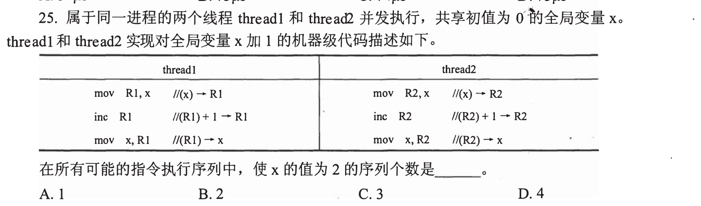

### 17 · 2019-23

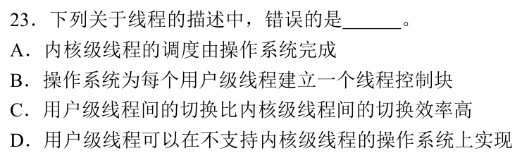

### 18 · 2019-27

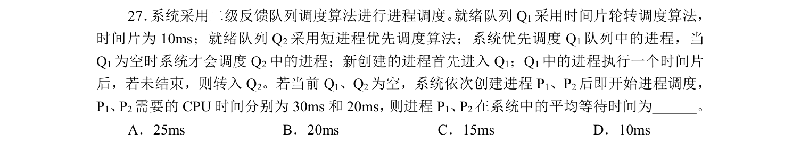

### 19 · 2020-26

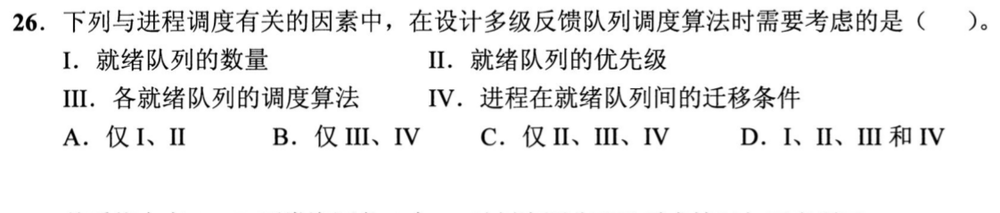

### 20 · 2020-29

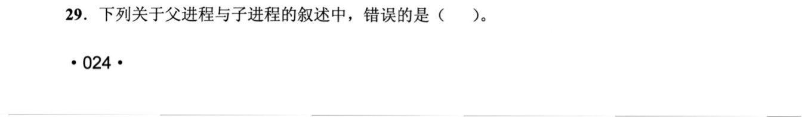

### 21 · 2021-24

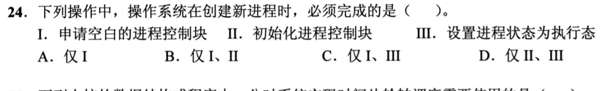

### 22 · 2021-25

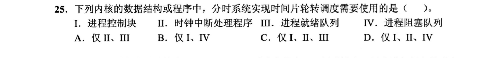

### 23 · 2021-27

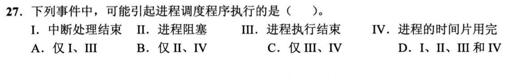

### 24 · 2022-23

### 25 · 2022-25

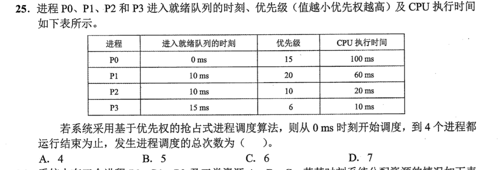

### 26 · 2022-28

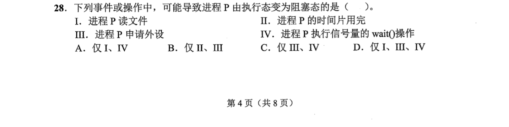

### 27 · 2023-27

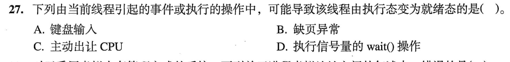

### 28 · 2023-29

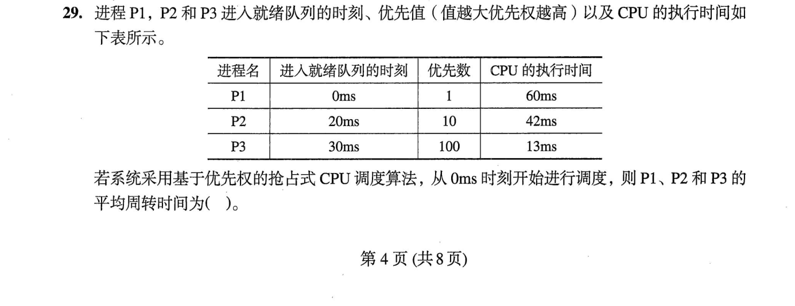

### 29 · 2024-24

### 30 · 2025-25

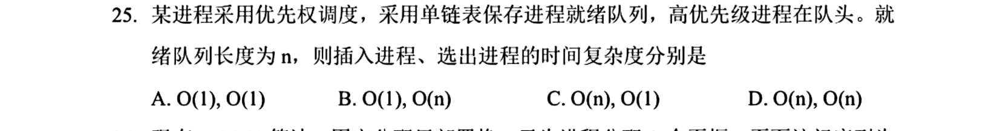

[← 0824](0824.md) · [总索引](README.md) · [0826 →](0826.md)
