[← 0829](0829.md) · [总索引](README.md) · [0831 →](0831.md)

# 0830｜文件路径：名字、索引、数据块与共享

> 能力线 `31-file` · 第 31/40 个节点 · 32 道真题引用
>
> [打开答题卡](http://127.0.0.1:8409/?date=0830)

## 故事梗概

一次文件访问从目录名解析到文件控制信息，再由逻辑偏移找到物理块。链接、打开文件表、分配方式和空闲空间管理都是这条路径上的不同数据结构。

这里的日期是链表节点，不是完成期限；是否前进，由这条能力线能否从题干恢复决定。

## 题单

### 01 · 2009-28

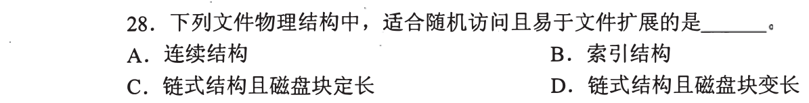

### 02 · 2009-30

### 03 · 2009-31

### 04 · 2010-30

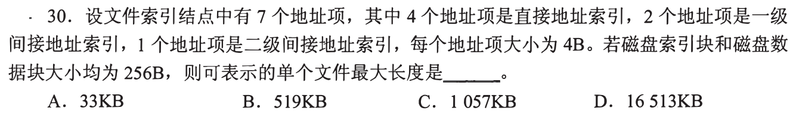

### 05 · 2010-31

### 06 · 2011-30

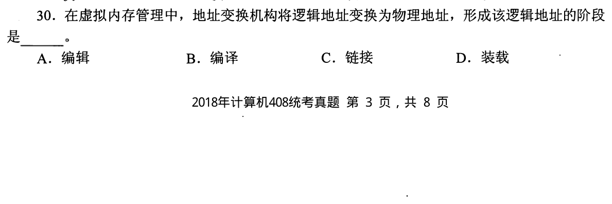

### 07 · 2011-31

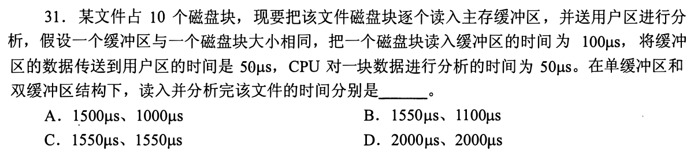

### 08 · 2012-32

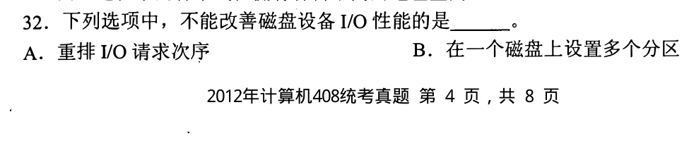

### 09 · 2013-23

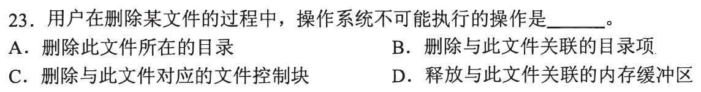

### 10 · 2013-24

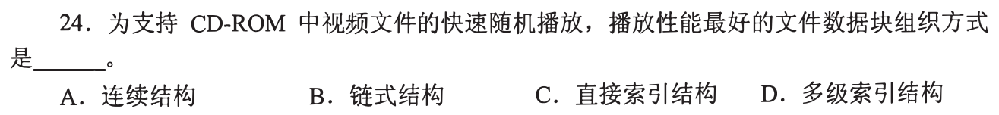

### 11 · 2013-26

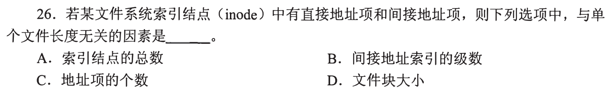

### 12 · 2014-29

### 13 · 2015-29

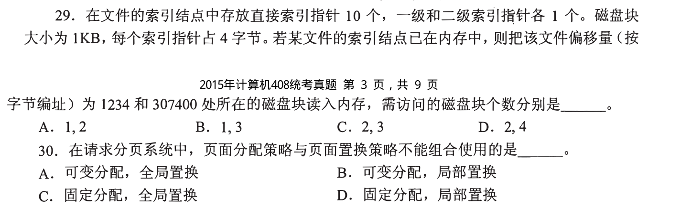

### 14 · 2015-30

### 15 · 2015-31

### 16 · 2017-26

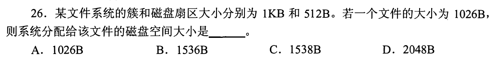

### 17 · 2017-29

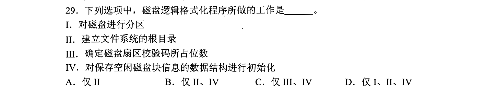

### 18 · 2017-31

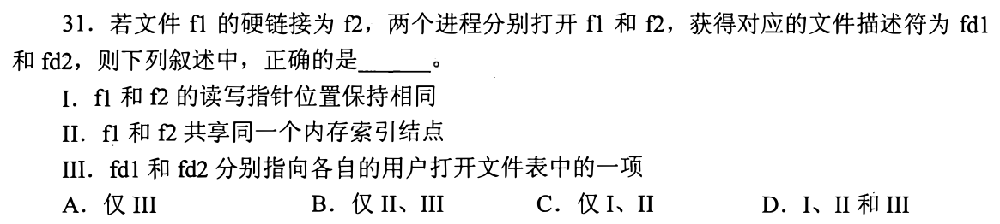

### 19 · 2018-31

### 20 · 2019-26

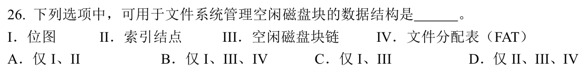

### 21 · 2019-31

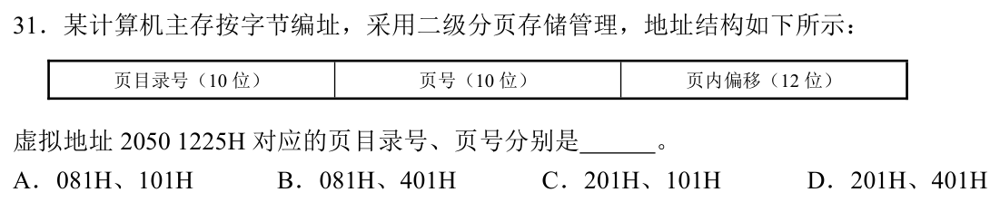

### 22 · 2020-23

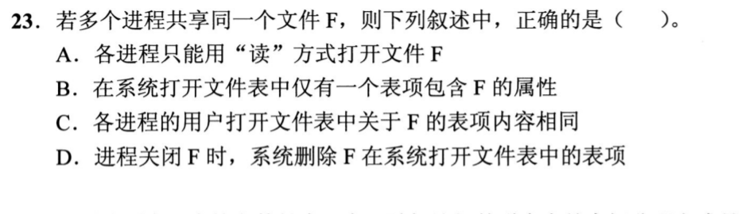

### 23 · 2020-30

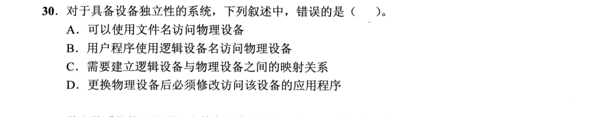

### 24 · 2020-31

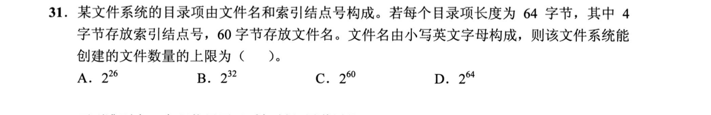

### 25 · 2021-30

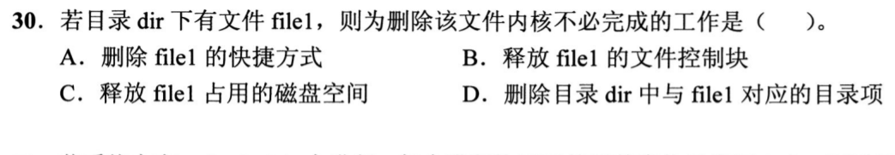

### 26 · 2023-31

### 27 · 2024-26

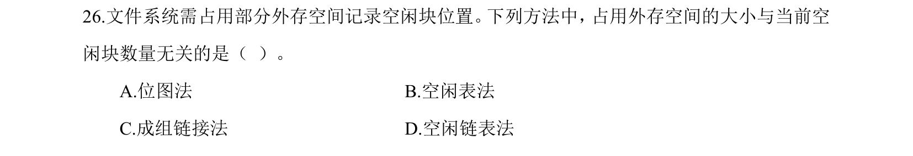

### 28 · 2024-29

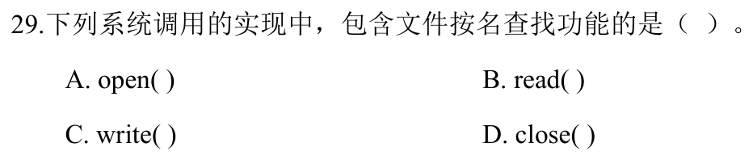

### 29 · 2025-28

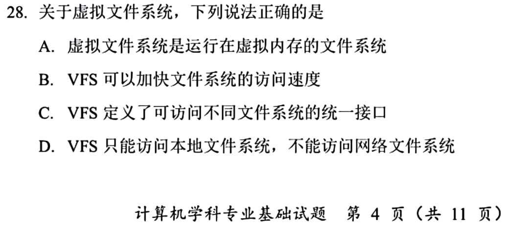

### 30 · 2025-29

### 31 · 2025-31

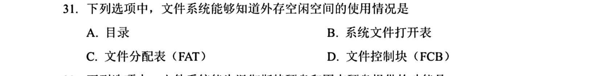

### 32 · 2025-32

[← 0829](0829.md) · [总索引](README.md) · [0831 →](0831.md)
