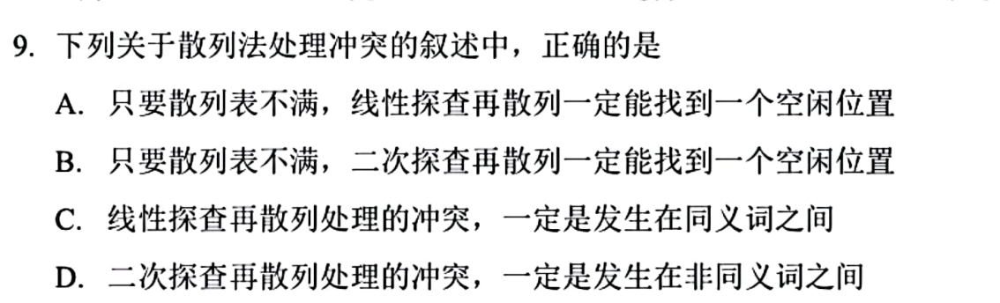
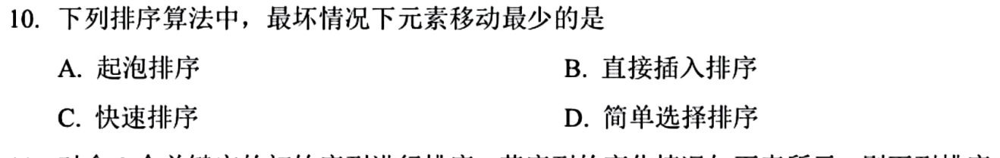
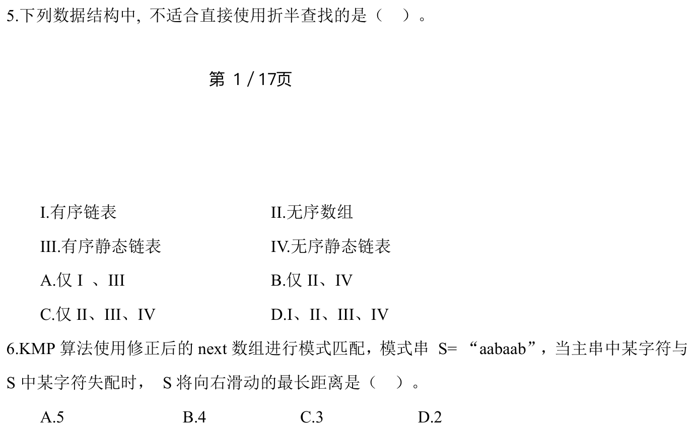
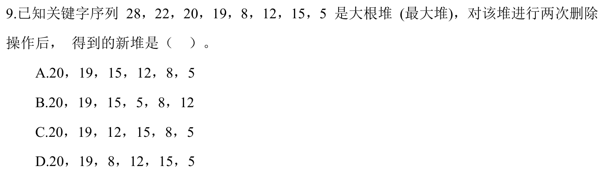
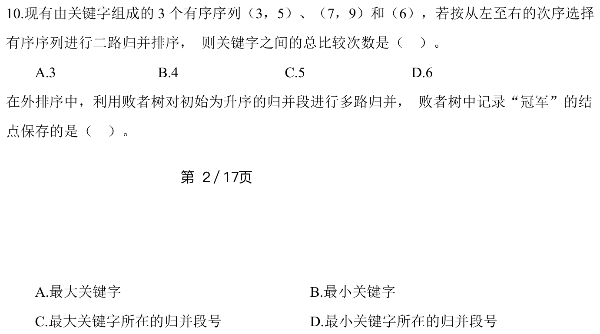
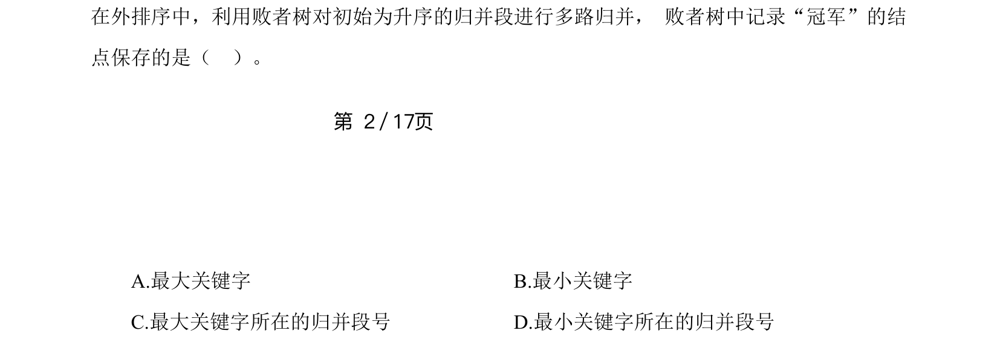
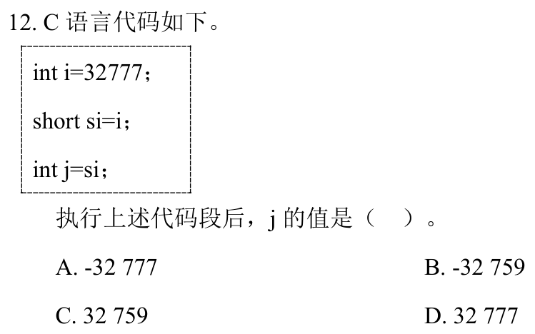
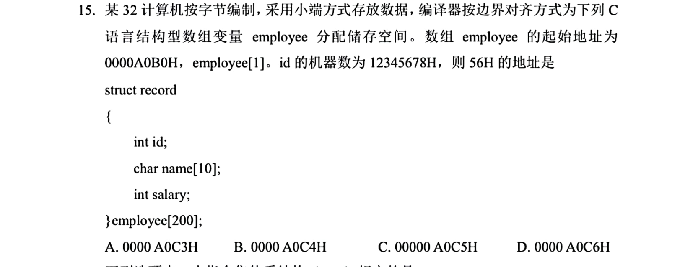
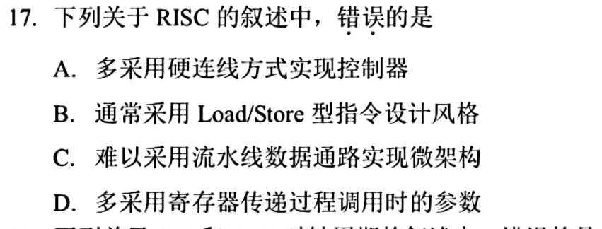

[« 0705-day01](0705-day01.md) | [» 0707-day03](0707-day03.md)

# Day 02 · 2026-07-06

> [!IMPORTANT]  [打开答题卡](http://127.0.0.1:8409/?date=0706)

> 今日 10 题；答题卡可选 `A/B/C/D/?`，`?` 表示不会。

## 题目

### 01 · 2025-09

作答：

### 02 · 2025-10

作答：

### 03 · 2024-05

作答：

### 04 · 2024-09

作答：

### 05 · 2024-10

作答：

### 06 · 2024-11

作答：

### 07 · 2024-12

作答：

### 08 · 2025-15

作答：

### 09 · 2025-16

作答：

### 10 · 2025-17

作答：

[« 0705-day01](0705-day01.md) | [» 0707-day03](0707-day03.md)
