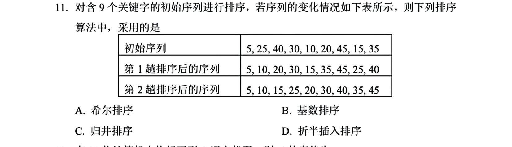
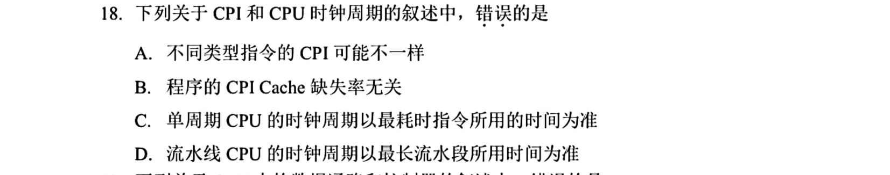
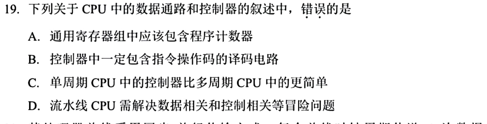
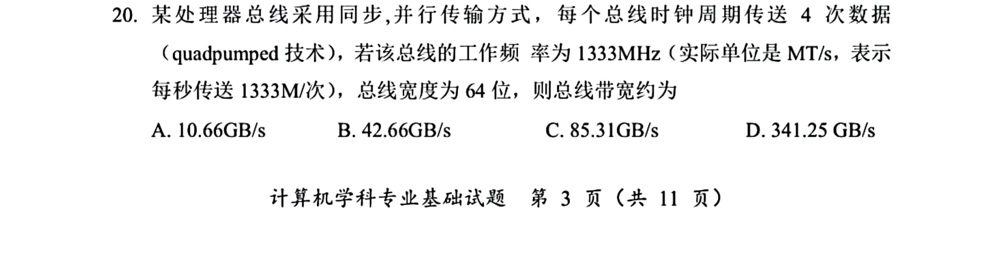

[« 0706-day02](0706-day02.md) | [» 0708-day04](0708-day04.md)

# Day 03 · 2026-07-07

> [!IMPORTANT]  [打开答题卡](http://127.0.0.1:8409/?date=0707)

> 今日 10 题；答题卡可选 `A/B/C/D/?`，`?` 表示不会。

## 题目

### 01 · 2024-14

作答：

### 02 · 2025-01

作答：

### 03 · 2025-11

作答：

### 04 · 2024-33

作答：

### 05 · 2025-33

作答：

### 06 · 2024-15

作答：

### 07 · 2025-34

作答：

### 08 · 2025-18

作答：

### 09 · 2025-19

作答：

### 10 · 2025-20

作答：

[« 0706-day02](0706-day02.md) | [» 0708-day04](0708-day04.md)
