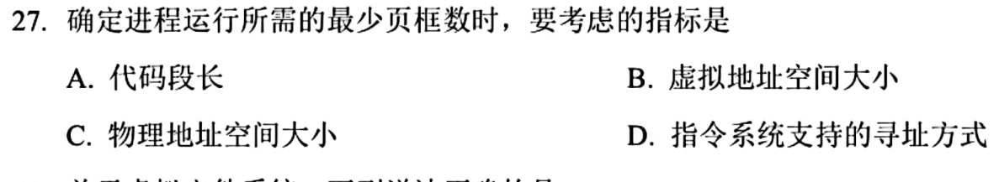
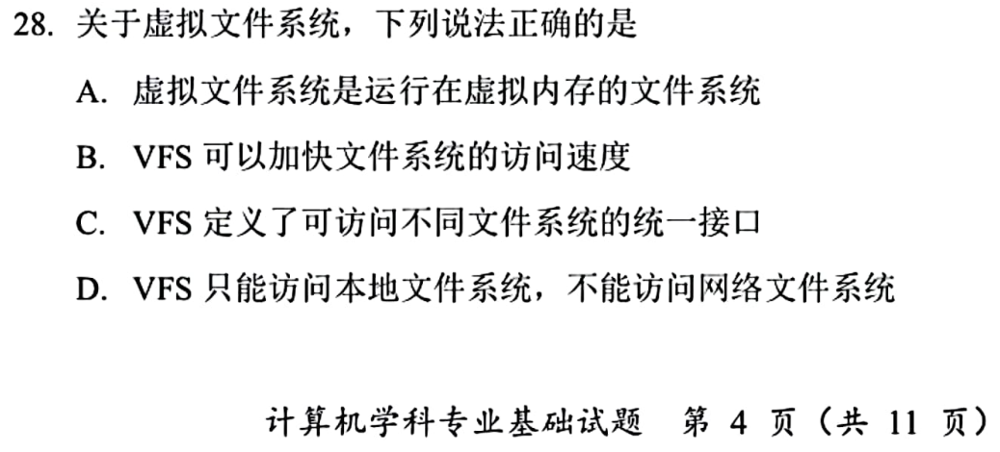
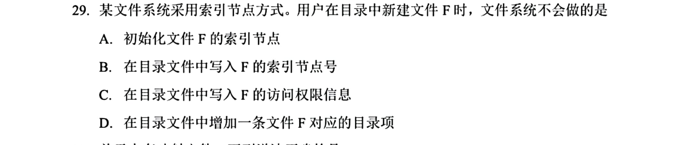
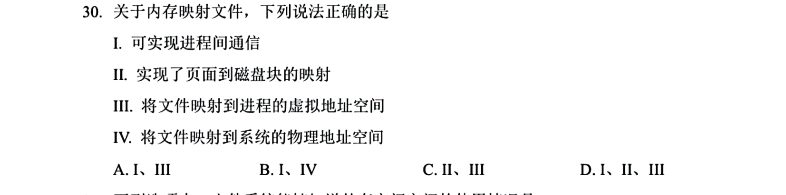
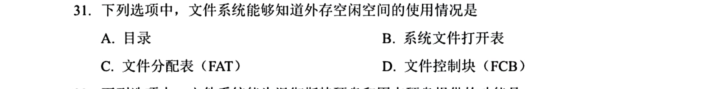
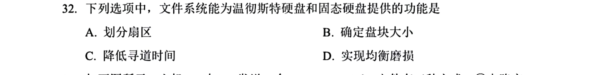

[« 0709-day05](0709-day05.md) | [» 0711-day07](0711-day07.md)

# Day 06 · 2026-07-10

> [!IMPORTANT]  [打开答题卡](http://127.0.0.1:8409/?date=0710)

> 今日 10 题；答题卡可选 `A/B/C/D/?`，`?` 表示不会。

## 题目

### 01 · 2025-27

### 02 · 2025-28

### 03 · 2025-29

### 04 · 2025-30

### 05 · 2025-31

### 06 · 2025-32

### 07 · 2025-36

### 08 · 2025-38

### 09 · 2025-39

### 10 · 2025-40

## 结果

已答 10 / 10；已判 10 题，对 2 题。

| # | 题号 | 作答 | 答案 | 结果 |
|---:|---|---|---|---|
| 01 | 2025-27 | 不会 | D | 不会 |
| 02 | 2025-28 | C | C | ✓ |
| 03 | 2025-29 | 不会 | C | 不会 |
| 04 | 2025-30 | 不会 | D | 不会 |
| 05 | 2025-31 | C | C | ✓ |
| 06 | 2025-32 | 不会 | B | 不会 |
| 07 | 2025-36 | 不会 | C | 不会 |
| 08 | 2025-38 | 不会 | A | 不会 |
| 09 | 2025-39 | 不会 | B | 不会 |
| 10 | 2025-40 | 不会 | B | 不会 |
[« 0709-day05](0709-day05.md) | [» 0711-day07](0711-day07.md)
